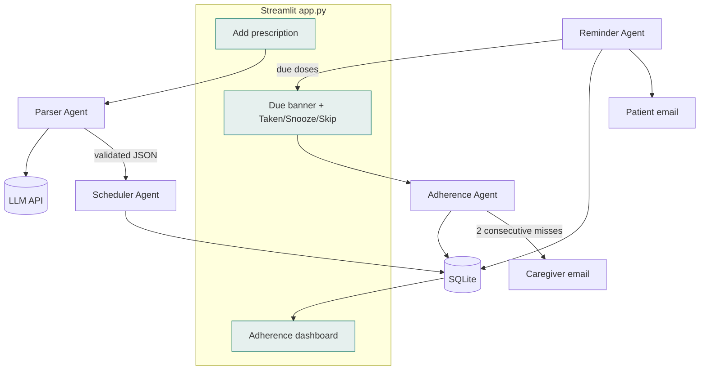

# Architecture

```mermaid
flowchart TB
  subgraph UI[Streamlit app.py]
    T1[Add prescription]:::t
    T2[Due banner + Taken/Snooze/Skip]:::t
    T3[Adherence dashboard]:::t
  end
  T1 --> P[Parser Agent]
  P --> LLM[(LLM API)]
  P -->|validated JSON| S[Scheduler Agent]
  S --> DB[(SQLite)]
  T2 --> A[Adherence Agent]
  R[Reminder Agent] -->|due doses| T2
  R --> DB
  A --> DB
  A -->|2 consecutive misses| E[Caregiver email]
  R --> E2[Patient email]
  DB --> T3
  classDef t fill:#E6F0EE,stroke:#0F766E
```

Data flow: text → Parser (JSON) → Scheduler (dose rows) → Reminder (due check every 5 s) → user action → Adherence (status, missed detection, caregiver alert, stats).
